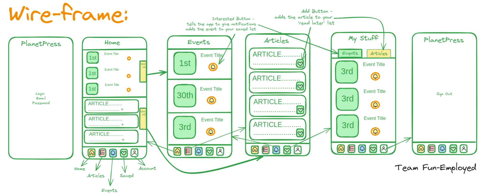
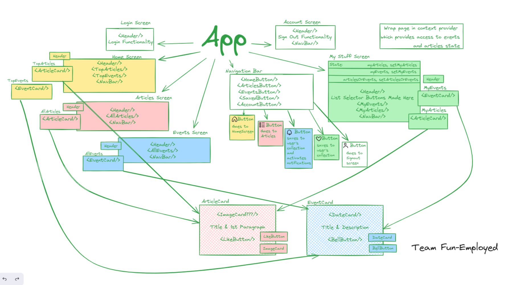

# PlanetPress

## Description
>
>> PlanetPress is a simple app which serves users the latest environmental news and events. Team Fun-Employed have used webscraping to gather the latest news and events from the web and display them in a simple and easy to use app. Users can also favourite articles and events to view later.

## Technologies Used
>
>> - React Native
>> - Expo
>> - Node.js
>> - Puppeteer
>> - Firebase

## Libraries Used
> 
>> - React Navigation
>> - React Native Paper
>> - React Native Vector Icons
>> - Expo-Router 

## Installation
>
>> - Clone or download the repo
>> - Run `npm install` to install dependencies
>> - Download the Expo app on your phone or an emulator on your computer
>> - Run `npm start` to start the app
>> - Scan the QR code with the Expo app on your phone or follow the terminal instructions to open the app on your emulator

## Wireframe:

## Component Tree:

## The Team

### Ryan Karakoc
> LinkedIn: https://www.linkedin.com/in/ryan-karakoc/
> GitHub: https://github.com/RyanKarakoc

### Bilaal Ahmad
> LinkedIn: https://www.linkedin.com/in/bilaal-ahmad/
> GitHub: https://github.com/Bilaal96

### Lily Levin
> LinkedIn: https://www.linkedin.com/in/lily-levin-37528541/
> GitHub: https://github.com/LpgLevin

### Ben Lucas
> LinkedIn: https://www.linkedin.com/in/benjamin-lucas-0ab164185/
> GitHub: https://github.com/retcon1

